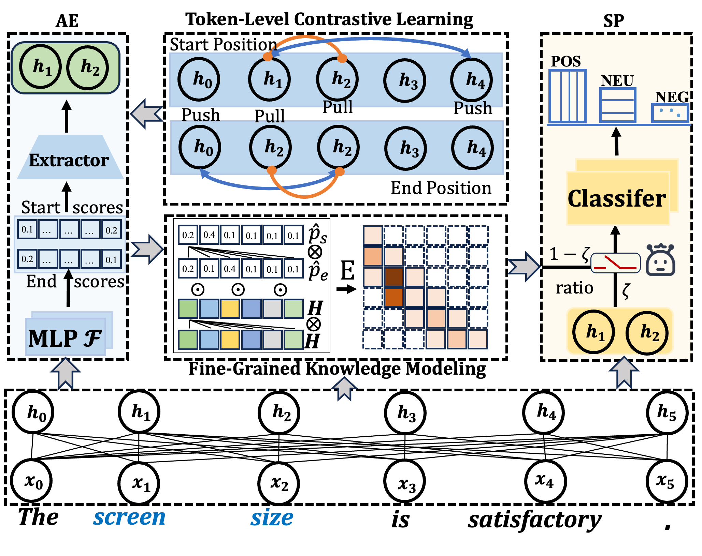

# FCKT: Fine-Grained Cross-Task Knowledge Transfer with Semantic Contrastive Learning  for Targeted Sentiment Analysis

This repo contains the code and data of the following paper:

In this paper, we design a novel span-based framework for the task of targeted sentiment analysis., which is shown as below:
<p>

</p>


This framework consists of two components:  
- Aspect extraction  
- Sentiment prediction

Both of two components utilize [BERT](https://github.com/huggingface/pytorch-pretrained-BERT) as backbone network. 

## Requirements
- Python 3
- [Pytorch 1.1](https://pytorch.org/) 
- numpy >= 1.13.3

Download the uncased [BERT-Large](https://drive.google.com/file/d/13I0Gj7v8lYhW5Hwmp5kxm3CTlzWZuok2/view?usp=sharing) model and unzip it in the current directory. 


## How to run the model
You can See  more details in folder absa. 

If you want to run the joint model, run the command blow, since the parameters of each data-set have been set:

```
python run.py 
```

The catalog of downloaded models is as follows：

  ```shell
  └─cache_bert_large
    ├─config.json
    ├─pytorch_model.bin
    ├─tokenizer_config.json
    ├─tokenizer.json
    ├─vocab.txt
  ```

And the result are replaced in out/ 

## Citation

If the code is used in your research, please star our repo and cite our paper as follows:

```shell
@inproceedings{chen2024modeling,
  title={FCKT: Fine-Grained Cross-Task Knowledge Transfer with Semantic Contrastive Learning  for Targeted Sentiment Analysis},
  author={Chen, Wei and Zhang, Zhao and Yuan, Meng and Xu, Kepeng and Zhuang, fuzhen},
  booktitle={IJCAI},
  year={2025}
}
```


